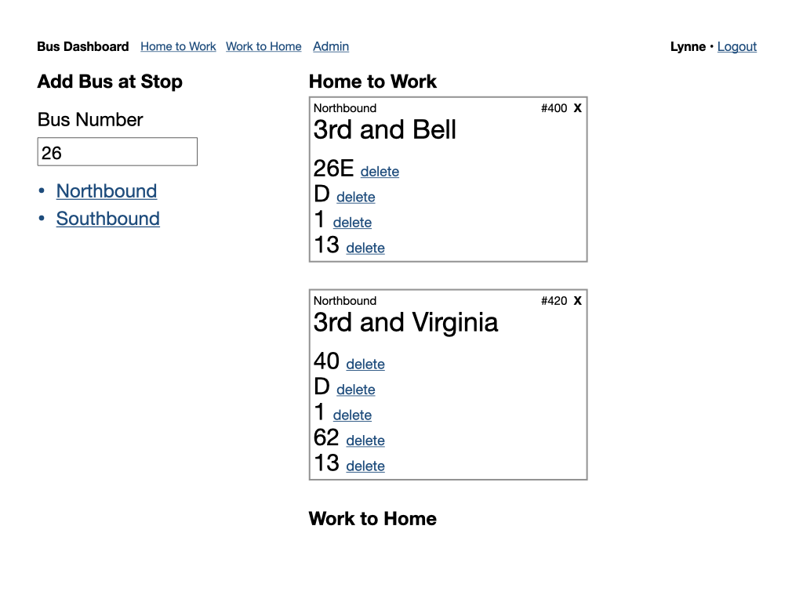
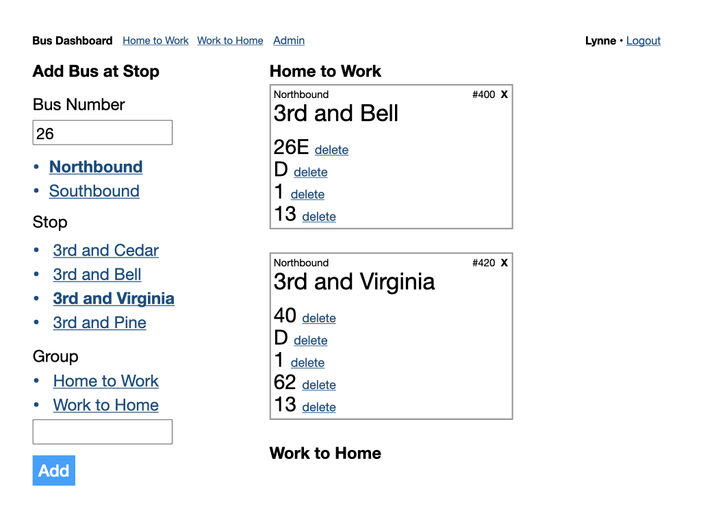
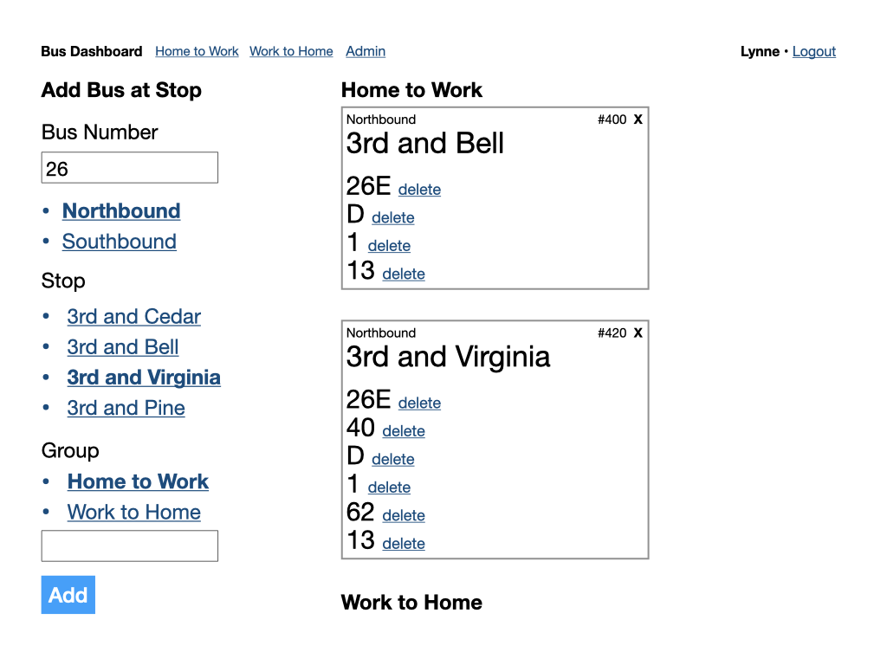

# Bus Arrival Dashboard

Google, OneBusAway, and other apps offer real-time bus arrival information. The OneBusAway app even displays animation with bus locations.

Sometimes you need something much simpler. I live close to two bus stops and different buses that can get me to my destination (work) stop at each of them. A dashboard listing only the buses I am interested in at only the stops I am interested in would be a very good thing in the morning.

The Bus Arrival Dashboard should group the buses by stop and sort them by arrival time. Color coding the arrival times would help me decide which stop to walk toward.

## Wireframes

### Sign in

### Main page

### Admin

## Dependencies

- node-sass
- OneBusAway API
  - Requires a key
- A host
- Firebase for authentication and user data
- Ruby 2.6.3 or greater
- Rails 6.0

## Tasks

- [ ] Rails backend app
  - Routes
    - [ ] Fetch route info for bus
    - [ ] Fetch arrival info for bus at stop
- [ ] Find host for Rails app
  - [ ] Deploy to host
- [ ] Create React App
  - [ ] Sign in
  - [ ] Admin
  - [ ] Main page

## Plan

### May 23-24 2020

- [x] Create Rails backend API

### May 30-31 2020

- [x] Find host and deploy Rails API
- [ ] Create React front end
  - [ ] Authorization using Firebase
  - [ ] Data storage using Firebase
  - [ ] Admin page to add and remove buses and groups
  - [ ] Main display

### June 6-7 2020

- [ ] Add navigation
- [ ] Add CSS styles
- [ ] Add any additional tests
- [ ] Deploy to host

## Setting up this app

### Local Development

- Clone this repository.
- Run `bundle install`
- Generate new credentials for OneBusAway API key: https://edgeguides.rubyonrails.org/security.html#custom-credentials
- To start the API and Web servers separately for development: `bundle exec foreman start -f Procfile.dev`

## Deploying to a host

- Host must support Ruby on Rails. Hosted on Heroku at https://intense-brushlands-86127.herokuapp.com/
- `npm run build` to create an optimized production build of the React front end
