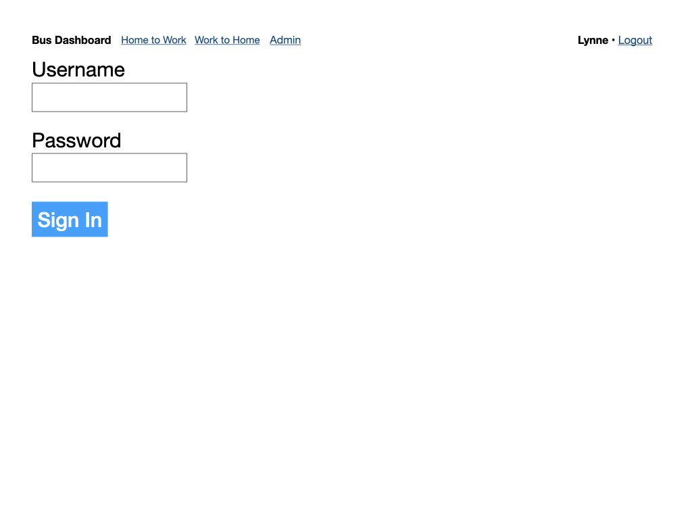
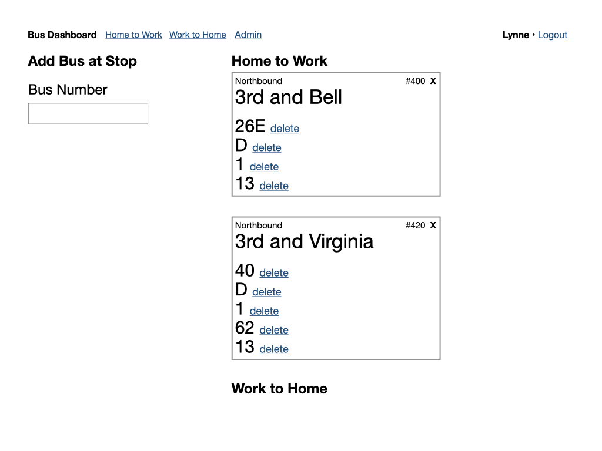
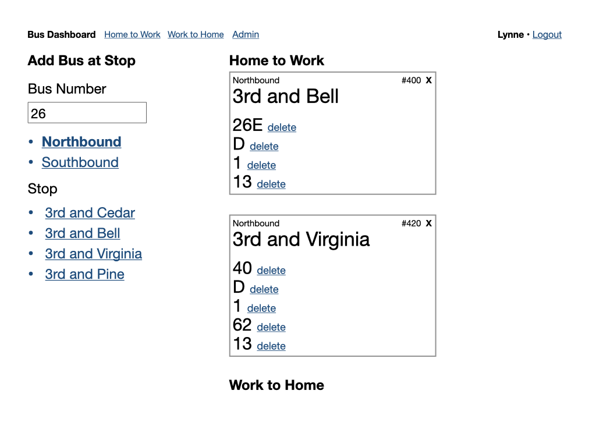
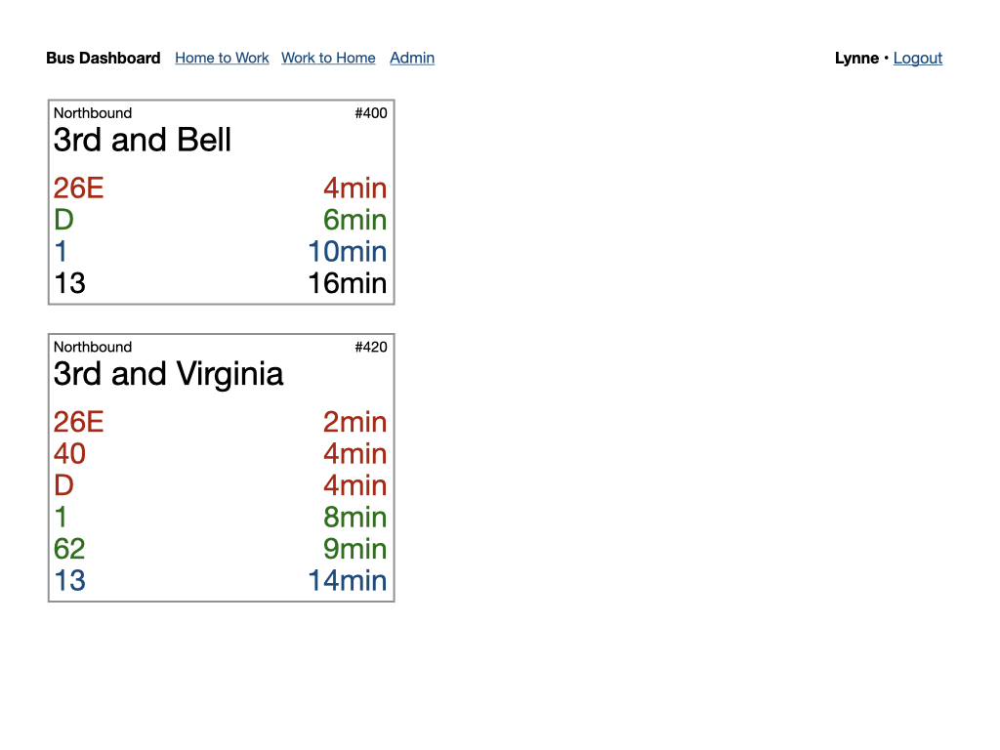

# Bus Arrival Dashboard

Google, OneBusAway, and other apps offer real-time bus arrival information. The OneBusAway app even displays animation with bus locations.

Sometimes you need something much simpler. I live close to two bus stops and different buses that can get me to my destination (work) stop at each of them. A dashboard listing only the buses I am interested in at only the stops I am interested in would be a very good thing in the morning.

The Bus Arrival Dashboard should group the buses by stop and sort them by arrival time. Color coding the arrival times would help me decide which stop to walk toward.

## Wireframes

## Dependencies

* node-sass
* OneBusAway API
* A back end to send requests to OneBusAway API (Rails API app)
* A host
* Firebase for authentication and user data

## Tasks

 - [ ] Rails backend app
   - Routes
     - [ ] Fetch route info for bus
     - [ ] Fetch arrival info for bus at stop
 - [ ] Find host for Rails app
 - [ ] Create React App
